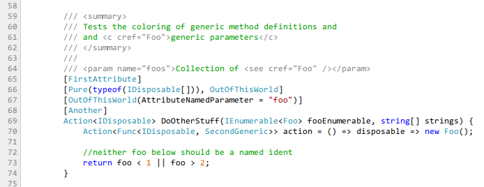

# Sunlight
[Sunlight](http://sunlightjs.com/) is a context-aware, client-side syntax
highlighter. It does as a good of a job as can be done highlighting code
without performing static analysis. Check out the [sexy demo!](http://sunlightjs.com/demo.html).

Licensed under WTFPL: http://sam.zoy.org/wtfpl/

## Installation
Download a pre-minified package from [here](http://sunlightjs.com/#download).

- Reference sunlight-all-min.js OR sunlight-min.js and language files of your choice.
- Reference a theme stylesheet (in themes/) or provide your own stylesheet.
- Place code inside an element with the class "sunlight-highlight-{language}" where
  language is the id of the language. e.g. "sunlight-highlight-csharp" for C#.

Refer to [the excruciatingly detailed documentation](http://sunlightjs.com/docs.html)
for other options.

## Supported languages
- C#
- PHP
- JavaScript
- MySQL
- XML
- CSS
- bash
- T-SQL
- Java
- Ruby
- Python
- Brainfuck
- nginx
- C/C++
- 6502 assembler
- Perl
- VB.NET
- httpd
- Lisp
- Visual Studio solution files (*.sln)
- DOS batch
- Haskell
- Erlang
- Diff (unified and context)
- Scala
- ActionScript
- PowerShell
- Objective-C
- Lua

## Plugins
- sunlight-plugin.linenumbers.js (bundled)
- sunlight-plugin.menu.js
- sunlight-plugin.doclinks.js
